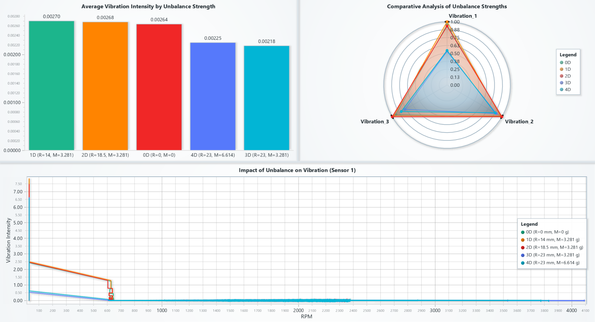
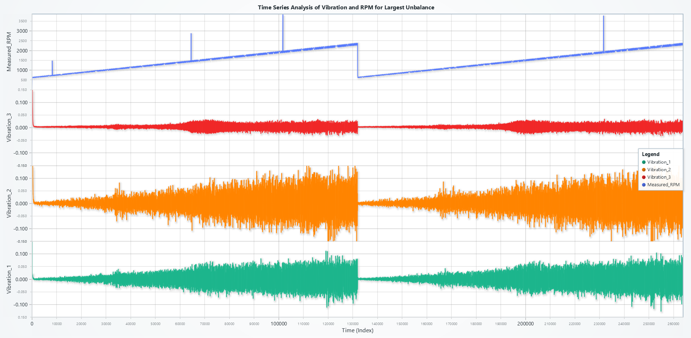
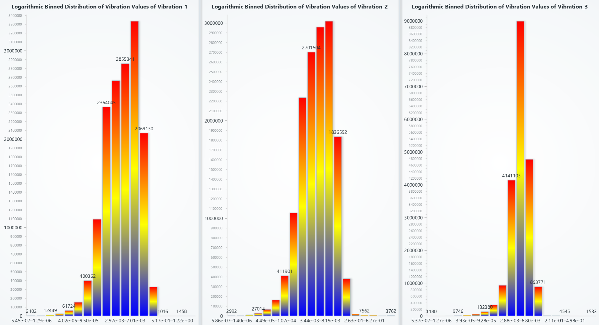
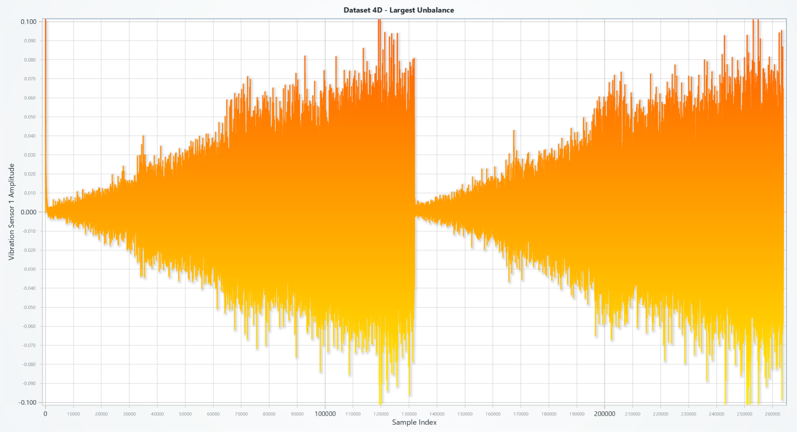

# **Vibration Analysis on Rotating Shaft with LightningChart Python**

## **What is Vibration Analysis?**

Vibration analysis refers to the process of monitoring the levels and patterns of vibration signals generated by a machine or its components. It serves as an essential diagnostic tool to detect faults, identify their causes, and predict failures in rotating machinery. Vibration is defined as a cyclic or oscillating motion from the rest position of a component or system. 

### **What is Machine Vibration?**
Machine vibration is an inherent phenomenon caused by unbalanced rotating components, misalignment, bearing wear, or resonance. It can be quantified using vibration sensors attached to critical areas of machinery. These sensors measure oscillations in components, enabling engineers to identify and fix potential issues before catastrophic failure occurs.

### **How Are Sensors Used to Collect Data?**
Vibration sensors capture real-time vibration signals as the machinery operates. In this project, PCB Synotech vibration sensors are placed strategically on a rotating shaft, measuring oscillations caused by varying levels of unbalance. A high sampling rate of 4096 Hz ensures detailed data acquisition, enabling fine-grained analysis.

---

## **LightningChart Python**

LightningChart Python is a high-performance data visualization library designed for handling large datasets with precision and speed. It enables the creation of interactive 2D and 3D charts with advanced customization capabilities, making it an ideal tool for vibration analysis.

### **Features and Chart Types**
For this project, the following chart types and features are leveraged:
- **Bar Charts**: For comparing vibration intensity across unbalance strengths.
- **Spider Charts**: To provide comparative visualizations of vibration components.
- **Line Charts**: For time-series data such as RPM vs. vibration intensity.
- **Heatmaps**: For frequency-domain analysis using spectrograms.
- **Gauge Charts**: To display live sensor readings and RPM.
- **Mesh Models**: To create realistic 3D visualizations of rotating shafts and components.

### **Performance Characteristics**
LightningChart excels in rendering high-density datasets with minimal lag, making it suitable for applications requiring real-time interactivity and smooth visualization transitions.

---

## **Setting Up the Python Environment**

### **Installing Python and Necessary Libraries**
1. Install Python (>= 3.7) from the [official Python website](https://www.python.org/).
2. Install required libraries using pip:
   ```bash
   pip install pandas numpy lightningchart trimesh scipy
   ```

### **Overview of Libraries Used**
- **NumPy**: For numerical computations, including signal processing and FFT.
- **Pandas**: For loading, processing, and organizing dataset components.
- **LightningChart**: For creating interactive and dynamic visualizations.
- **Trimesh**: For 3D mesh modeling of machinery components.
- **SciPy:** Advanced scientific computing, including signal analysis.

### Setting Up Your Development Environment
1. Set up a virtual environment:
```bash
python -m venv rf_analysis_env
source rf_analysis_env/bin/activate  # On Windows: rf_analysis_env\Scripts\activate
```
2. Use **Visual Studio Code (VSCode)** for a streamlined development experience.

---

## **Loading and Processing Data**

### **How to Load the Data Files**
The dataset consists of CSV files named according to their unbalance strength (e.g., `0D.csv`, `1D.csv`)([Link to dataset](https://www.kaggle.com/datasets/jishnukoliyadan/vibration-analysis-on-rotating-shaft)). Each file contains the following columns:
1. `V_in`: Input voltage to the motor controller.
2. `Measured_RPM`: Rotational speed of the shaft.
3. `Vibration_1`, `Vibration_2`, `Vibration_3`: Signals from the vibration sensors.

### **Handling and Preprocessing the Data**
The dataset is preprocessed by:
1. Filtering rows with valid RPM values.
2. Normalizing vibration amplitudes for comparison across datasets.
3. Sampling the data at regular intervals for efficient visualization.

---

### **Visualizing Data with LightningChart**

---

### **1.Dashboard: Vibration Intensity and Unbalance Comparison**

**Description:**  
This dashboard integrates three complementary charts—**Bar Chart**, **Spider Chart**, and **Line Chart**—to comprehensively visualize the relationships between unbalance strength, vibration intensity, and RPM. It enables intuitive comparisons across datasets and provides actionable insights into vibration behavior under various operating conditions.

---

#### **1. Average Vibration Intensity by Unbalance Strength**  
The bar chart in the first column of the dashboard displays the average vibration intensity for each dataset, categorized by unbalance strength. Each bar represents a unique unbalance configuration defined by radius and mass. This visualization quantifies the overall impact of unbalance strength on vibration levels.  

#### **2. Comparative Analysis of Unbalance Strengths**  
The spider chart in the second column visualizes the distribution of vibration components (`Vibration_1`, `Vibration_2`, `Vibration_3`) for various unbalance strengths. Data points are normalized to enable clear comparison across datasets. Each axis corresponds to a vibration metric, highlighting specific vibration patterns under different configurations.

#### **3. Impact of Unbalance on Vibration (Sensor 1)**  
The line chart in the second row captures how vibration intensity, measured by Sensor 1, changes with RPM for each unbalance strength. Each line represents a dataset, allowing dynamic tracking of vibration behavior as rotational speed increases.  

---

**Results:**  
- **Bar Chart:** The vibration intensity decreases with increasing unbalance strength, particularly for configurations with higher radius and mass (e.g., 4D dataset). The 0D dataset (no unbalance) shows the lowest vibration intensity, confirming the importance of balance.  
- **Spider Chart:** Configurations with higher unbalance strengths (e.g., 4D) exhibit pronounced variation in specific vibration components, while the 0D dataset remains consistently low across all metrics.  
- **Line Chart:** Vibration intensity decreases significantly with increasing RPM, especially for higher unbalance strengths. The 0D dataset shows minimal variation, demonstrating its stability.  

---

**Use Cases:**  
- **Diagnostic Insights:** Understand how unbalance affects overall vibration levels across metrics and RPM.  
- **Design Optimization:** Optimize machine configurations by reducing unbalance-induced vibrations.  
- **Dynamic Monitoring:** Track vibration behavior across RPM ranges to identify critical thresholds.  

---

**Script Summary:**  
The following snippets outline the implementation of the three charts within the dashboard:  

1. **Bar Chart**  
```python
average_vibrations = sampled_data.groupby('Dataset_ID')[['Vibration_1', 'Vibration_2', 'Vibration_3']].mean()
average_vibrations['Average_Vibration'] = average_vibrations.mean(axis=1)

bar_data = [{'category': label, 'value': value} for label, value in zip(unbalance_labels, average_vibrations['Average_Vibration'])]

chart_avg_vibration = dashboard.BarChart(row_index=0, column_index=0, vertical=True)
chart_avg_vibration.set_title('Average Vibration Intensity by Unbalance Strength')
chart_avg_vibration.set_data(bar_data)
```

2. **Spider Chart**  
```python
chart_spider = dashboard.SpiderChart(row_index=0, column_index=1)
chart_spider.set_title('Comparative Analysis of Unbalance Strengths')
for metric in vibration_columns:
    chart_spider.add_axis(metric)
for dataset_name, values in normalized_summary_data.items():
    series = chart_spider.add_series()
    series.add_points([{'axis': metric, 'value': value} for metric, value in zip(vibration_columns, values)])
```

3. **Line Chart**  
```python
chart_rpm_vibration = dashboard.ChartXY(row_index=1, column_index=0, column_span=2, title='Impact of Unbalance on Vibration (Sensor 1)')
for key, group in grouped_data.items():
    series = chart_rpm_vibration.add_line_series()
    series.set_name(f"{key} (R={unbalance_info[key]['Radius']} mm, M={unbalance_info[key]['Mass']} g)")
    series.add(group['Measured_RPM'].tolist(), group['Vibration_1'].tolist())
chart_rpm_vibration.get_default_x_axis().set_title('RPM')
chart_rpm_vibration.get_default_y_axis().set_title('Vibration Intensity')
```

  

---

### **2. Time Series Analysis of Vibration and RPM**
**Description:**
This line chart visualizes the variation of vibration intensity and measured RPM over time for all datasets. The chart uses separate Y-axes to compare vibration amplitudes (`Vibration_1`, `Vibration_2`, `Vibration_3`) with RPM.

**Results:**
- Vibration intensity decreases sharply as RPM stabilizes, especially for higher unbalance datasets.
- The chart highlights the synchronization between RPM and vibration fluctuations.

**Use Cases:**
- **Fault Detection:** Identify abnormal vibration patterns at specific RPM ranges.
- **Maintenance Scheduling:** Predict potential failure points based on vibration trends.

**Script Summary:**
```python
chart_rpm_vibration = dashboard.ChartXY(row_index=1, column_index=0, column_span=2, title='Impact of Unbalance on Vibration (Sensor 1)')
for key, group in grouped_data.items():
    series = chart_rpm_vibration.add_line_series()
    series.add(group['Measured_RPM'].tolist(), group['Vibration_1'].tolist())
chart_rpm_vibration.get_default_x_axis().set_title('RPM')
chart_rpm_vibration.get_default_y_axis().set_title('Vibration Intensity')
```

  

---

### **3. Logarithmic Distribution of Vibration**
**Description:**
Logarithmic histograms visualize the binned distribution of vibration amplitudes for each sensor. Logarithmic binning ensures a better representation of both low and high amplitude ranges.

**Results:**
- Most vibration values are concentrated in lower amplitude ranges, with a steep decline in frequency for higher values.
- Sensor 3 records significantly higher amplitudes compared to Sensors 1 and 2.

**Use Cases:**
- **Amplitude Analysis:** Understand the distribution of vibration intensities for fault diagnosis.
- **Data Reduction:** Focus on significant vibration ranges to optimize analysis.

**Script Summary:**
```python
log_bins = np.logspace(np.log10(min_val), np.log10(max_val), num=30)
counts, bin_edges = np.histogram(values, bins=log_bins)
bar_data = [{"category": f"{bin_edges[j]:.2e}–{bin_edges[j+1]:.2e}", "value": int(count)} for j, count in enumerate(counts) if count > 0]
chart = dashboard.BarChart(row_index=0, column_index=i)
chart.set_title(f'Logarithmic Binned Distribution of Vibration Values of {col}').set_data(bar_data)
```

  

---

### **4. Dataset 4D: Largest Unbalance**
**Description:**
This line chart dynamically visualizes the vibration amplitude for the largest unbalance dataset (`4D`). A color-coded line series maps amplitude intensities, highlighting significant vibration patterns.

**Results:**
- The largest unbalance leads to high vibration amplitudes, especially at the start and end of the sample index range.
- Peaks in the graph correspond to unbalance-induced instability.

**Use Cases:**
- **Testing Extreme Cases:** Validate system behavior under maximum unbalance conditions.
- **Performance Benchmarking:** Assess the robustness of components under stress.

**Script Summary:**
```python
line_series = chart.add_line_series().add(sample_index, vibration_amplitude)
line_series.set_palette_line_coloring(steps=[{'value': -0.05, 'color': lc.Color('blue')}, {'value': 0, 'color': lc.Color('yellow')}, {'value': 0.05, 'color': lc.Color('red')}])
chart.get_default_x_axis().set_title("Sample Index")
chart.get_default_y_axis().set_title("Vibration Sensor 1 Amplitude")
```

  

---

### **5. Frequency Domain Analysis with FFT**
**Description:**
A spectrogram-based heatmap correlates vibration frequencies with rotation speed (RPM). It uses FFT (Fast Fourier Transform) to convert the signal from the time domain to the frequency domain.

**Results:**
- Dominant frequencies align with specific RPM ranges, indicating resonance points.
- High amplitudes appear as streaks on the heatmap, highlighting critical vibration zones.

**Use Cases:**
- **Frequency Analysis:** Detect resonant frequencies to avoid structural damage.
- **Dynamic Balancing:** Identify RPM ranges requiring adjustments.

**Script Summary:**
```python
frequencies, times, Sxx = spectrogram(vibration, fs=4096, nperseg=1024, noverlap=512)
heatmap.set_start(x=frequencies.min(), y=interp_rpm.min())
heatmap.set_end(x=frequencies.max(), y=interp_rpm.max())
heatmap.invalidate_intensity_values(Sxx.T.tolist())
```

  

---

### **7. Rotating Shaft Visualization**
**Description:**
A 3D dashboard combines mesh models, gauge charts, and line charts for real-time visualization of vibration and stress dynamics in a rotating shaft.

**Results:**
- The color distributions on the unbalance holder and sensors change dynamically based on varying vibration levels. Additionally, the color of the unbalance holder transitions from blue to red as the rotation speed increases.
- To provide a comprehensive view of how sensor vibrations change with increasing rotation speed, the second column in the top row visualizes the relationship between the vibration intensity of the three sensors and RPM. This visualization includes a dynamic constant yellow line that moves from left to right as the rotation speed increases.
- Gauge charts provide real-time RPM and vibration intensity readings.

**Use Cases:**
- **Simulation Testing:** Visualize experiment setup in dynamic systems.
- **Real-Time Monitoring:** Monitor operational parameters during live testing.

**Script Summary:**
```python
wheel_mesh.set_palette_coloring(steps=[{'value': 20, 'color': lc.Color('blue')}, {'value': 500, 'color': lc.Color('yellow')}, {'value': 1000, 'color': lc.Color('red')}])
vibration_chart_1.set_value(scaled_vibration_values[0])  # Sensor 1 vibration
wheel_chart.set_value(rpm_value)
wheel_model.set_model_rotation(accumulated_angle, 90, 0)
```

  

---

### **8. Vibration and Stress Levels**

**Description:**
This combined visualization utilizes a 3D dynamic model and multi-axis line charts to display real-time vibration and stress levels across critical components, including sensors, the bearing block, and the rotating shaft. The system updates dynamically with each iteration, simulating real-world operating conditions. Note that shear stress is not provided in the dataset and is calculated in a non-scientific manner solely to demonstrate how stress distribution in a rotating shaft could be visualized.

**Results:**
- **Vibration Sensors:** Sensors 1, 2, and 3 exhibit a proportional increase in vibration intensity as RPM increases.
- **Stress Distribution:** The bearing block and cylinder experience stress accumulation near critical points, with peak levels occurring at high RPM.
- **Dynamic Response:** The visualization effectively highlights the interactions between vibration and stress, assisting in fault detection and system optimization.

**Use Cases:**
- **Stress Localization:** Identify the areas of maximum stress in the rotating machinery.
- **Component Evaluation:** Assess the durability of bearings and shafts under variable loads.
- **Predictive Maintenance:** Use vibration and stress trends to predict wear and failure.

**Script Summary:**

```python
# Add dynamic color palettes for stress visualization
cylinder_mesh.set_palette_coloring(
    steps=[
        {'value': 9, 'color': lc.Color('lightblue')},
        {'value': 10, 'color': lc.Color('green')},  # Moderate stress
        {'value': 40, 'color': lc.Color('yellow')}, # High stress
        {'value': 67.5, 'color': lc.Color('red')}   # Critical stress
    ],
    look_up_property='value',
    interpolate=True
)

# Generate stress values dynamically for the cylinder and bearing block
cylinder_stress = generate_stress_values(
    cylinder_vertices, wheel_connection, max_stress, cylinder_scale, cylinder_location
)
bearing_block_stress = generate_stress_values(
    bearing_block_vertices, wheel_connection, max_stress, bearing_block_scale, bearing_block_location
)

# Normalize stress values and update the 3D meshes
cylinder_stress_normalized = normalize_forces(cylinder_stress, min_stress, max_stress)
bearing_block_stress_normalized = normalize_forces(bearing_block_stress, min_stress, max_stress)
cylinder_mesh.set_vertex_values(lambda: cylinder_stress_normalized)
bearing_block_mesh.set_vertex_values(lambda: bearing_block_stress_normalized)

# Add line series to the multi-axis line chart
for i, sensor in enumerate(sensors):
    y_axis = chart_line.add_y_axis(stack_index=i)
    y_axis.set_title(sensor)
    series = chart_line.add_line_series(y_axis=y_axis, data_pattern='ProgressiveX')
    series.set_name(sensor)
    series.add([time_ms], [all_values[i]])  # Add stress and vibration data
```

  

---

### **Results in Detail:**
- **3D Model:** The rotating shaft's dynamic response to vibration and stress is visualized in real time. Stress hot spots are highlighted in red, showing areas with critical load.
- **Line Chart:** Real-time line charts for each sensor provide a quantitative view of vibration and stress levels, with stacked Y-axes allowing detailed analysis.
- **Operational Insight:** RPM values are directly correlated with stress intensity, confirming the effect of rotational speed on component durability.

---

## **Conclusion**

This project demonstrates the power of LightningChart Python for visualizing high-density vibration data. By leveraging advanced charts and 3D visualizations, engineers can gain deeper insights into machine dynamics, enabling predictive maintenance and minimizing downtime.
